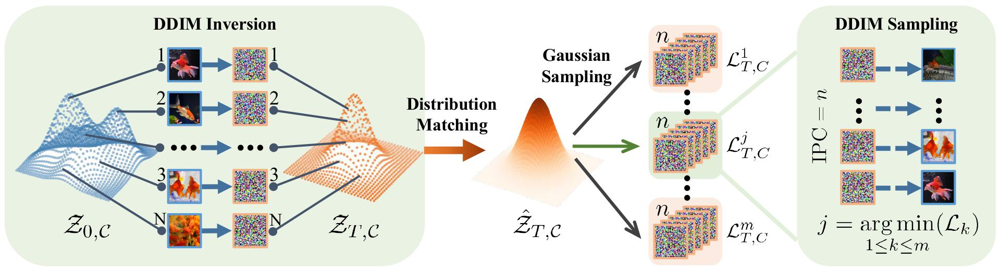

# Taming Diffusion for Dataset Distillation with High Representativeness (ICML 2025)

This repository is the official implementation of the paper:

[**Taming Diffusion for Dataset Distillation with High Representativeness**](https://www.arxiv.org/pdf/2505.18399)
[*Lin Zhao*](https://lin-zhao-resolve.github.io/),
[*Yushu Wu*](https://wuyushuwys.github.io/),
[*Xinru Jiang*](https://oshikaka.github.io/),
[*Jianyang Gu*](https://vimar-gu.github.io/),
[*Yanzhi Wang*](https://coe.northeastern.edu/people/wang-yanzhi/),
[*Xiaolin Xu*](https://www.xiaolinxu.com/),
[*Pu Zhao*](https://puzhao.info/),
[*Xue Lin*](https://coe.northeastern.edu/people/lin-xue/),
ICML, 2025.

<div align=center>

</div>

## Usage

1. [Distilled Datasets](#distilled-datasets)
2. [Setup](#setup)
3. [Step1: DDIM inversion and distribution matching](#step1-ddim-inversion-and-distribution-matching)
4. [Step2: Group sampling](#step2-group-sampling)
6. [Evaluation](#evaluation)


## Distilled Datasets
We provide distilled datasets with different IPCs generated by our method on Huggingface🤗! [*Imagenet-1K*](https://www.image-net.org/), [*Tiny-Imagenet*](https://www.kaggle.com/c/tiny-imagenet), [*CIFAR10*](https://www.cs.toronto.edu/~kriz/cifar.html), [*CIFAR100*](https://www.cs.toronto.edu/~kriz/cifar.html) datasets for users to use directly. 

🔥Distilled datasets for Imagenet-1K: [10IPC](https://huggingface.co/datasets/lin-zhao-resoLve/D3HR/tree/main/imagenet1k_10ipc), [50IPC](https://huggingface.co/datasets/lin-zhao-resoLve/D3HR/tree/main/imagenet1k_50ipc)

🔥Distilled datasets for Tiny-Imagenet: [10IPC](https://huggingface.co/datasets/lin-zhao-resoLve/D3HR/tree/main/tinyimagenet_10ipc), [50IPC](https://huggingface.co/datasets/lin-zhao-resoLve/D3HR/tree/main/tinyimagenet_50ipc)

🔥Distilled datasets for CIFAR10: [10IPC](https://huggingface.co/datasets/lin-zhao-resoLve/D3HR/tree/main/cifar10_10ipc), [50IPC](https://huggingface.co/datasets/lin-zhao-resoLve/D3HR/tree/main/cifar10_50ipc)

🔥Distilled datasets for CIFAR100: [10IPC](https://huggingface.co/datasets/lin-zhao-resoLve/D3HR/tree/main/cifar100_10ipc), [50IPC](https://huggingface.co/datasets/lin-zhao-resoLve/D3HR/tree/main/cifar100_50ipc)

Besides, if you want to use the D3HR to generate distilled datasets by yourself, run the following steps:

## Setup

To install the required dependencies, use the following commands:

```bash
conda create -n D3HR python=3.10
conda activate D3HR
cd D3HR
pip install -e .
```

## Step1: DDIM inversion and distribution matching

### (1) load pretrained model
For Imagenet-1K dataset, you can just use the pretrained [DiT](https://github.com/facebookresearch/DiT) model in huggingface:
```bash
huggingface-cli download facebook/DiT-XL-2-256 --local-dir <your_local_path>
```
For other datasets, you must first fine-tune the pretrained DiT model on the dataset ([github repo](https://github.com/facebookresearch/DiT)), then continue. 

### (2) perform DDIM inversion and distribution matching to obtain the statistic information
```bash
sh generation/dit_inversion_save_statistic.sh
```
Note: By default, we store the results at 15 timesteps (23 < t < 39) to support the experiments in Section 6.2.

## Step2: Group sampling
```bash
sh generation/group_sampling.sh
```


## Evaluation
```bash
sh validation/validate.sh
```
Note: The .sh script includes several configuration options—select the one that best fits your needs. For CIFAR-10, CIFAR-100, and tinyimagenet, you need first download the pretrained teacher weights from ([RDED](https://github.com/LINs-lab/RDED?tab=readme-ov-file)) and place them in the pretrain_models folder.

## Acknowledgement
This project is mainly developed based on:
[DiT](https://github.com/facebookresearch/DiT)


## Contact
If you have any questions, please contact zhao.lin1@northeastern.edu.

## Citation
If you find our work useful, please cite:

```BiBTeX
@inproceedings{zhaotaming,
  title={Taming Diffusion for Dataset Distillation with High Representativeness},
  author={Zhao, Lin and Wu, Yushu and Jiang, Xinru and Gu, Jianyang and Wang, Yanzhi and Xu, Xiaolin and Zhao, Pu and Lin, Xue},
  booktitle={Forty-second International Conference on Machine Learning}
}
```
